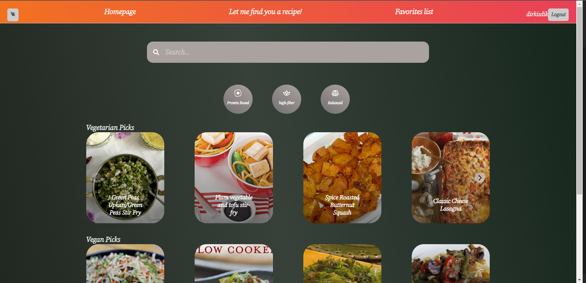

# Functionality
This application is built to be able to fetch over 2.3 million recipes and showcase that to you as a user. There are a couple of ways to fetch those recipes. It is for example possible to use the searchbar, by answering questions and by using the different buttons.

### Usage

This is a photo of the homepage of the app. This showcases the most important page of the app. The red navigation bar will be visible on any page (excluding the pre-log in pages) and; 
1. includes going back to the homepage, 
2. to the questions page to answer questions and getting recipes based on your answers, 
3. to your own favorite list that you can modify to your needs
4. the logout button to log out, 
5. and last but not least, the theming button to give your eyes some rest.

It also has some pre-built-in categories that you can choose from to fetch recipes with the most popular categories. It's ofcourse completely possible to search for whatever ingredient or name that you can think of, by using the searchbar.

# Requirements

This application is depended on some programs and environments. I will list them here and provide the installation manual wherever one is required.

### 1. Code editors
I strongly recommend the usage of a code editor like Webstorm. it is completely possible to use Notepad, which is a default Windows program, but using a code editor like Webstorm, wil exponential improve you experience. However, Webstorm is a paid product, so free code editors such as Visual Studio Code is fine aswell.

### 2. Web browser
To be able to use this application, it is a requirement to have a web browser like Google Chrome. You weren't able to read this without a web browser anyway, but just to be thoroughly I give it a mention.

### 3. Node.js
To be able to run the code provided in the src directory, you will need to have installed Node.js. Node.JS is a runtime environment that makes it available to run code locally on your computer. I will now provide how to manually install Node.js: 
1. Open a new project in any code editor.
2. Create a new javaScript file in this project.
3. Install Node.js via this link https://nodejs.org/en/download. You can skip this step if you already installed Node.js. To check if the installation was completed you can open the terminal and type the following command to see the version. if nothing happened, you will know that the installation was not complete amd you will need to redo this step.

### `node -v`

4. After successful installation, check the if npm is installed aswell by typing:

### `npm -v`

5. now install nodemon to make your user experience more friendly by using this: 
### `npm istall -g nodemon`

it should now work ....

### 4. Dependencies
The following packages are required to be able to run the application. To install the packages (which is required and therefore mandatory) you will need to do the following: 
1. open your terminal,
2. type the following command. This will install all the packages and so that you don't have to do that manually. 
### `npm install`
splidejs/react-splide, 

testing-library/jest-dom,

testing-library/react,

testing-library/user-event,

async,

axios,

params,

prop-types,

react,

react-dom,

react-icons,

react-router-dom,

react-scripts,

scripts, 

web-vitals.

### 5. API Key and ID
The application makes use of an API. To be able to make requests to the API (for you by just using the site and for example waiting for the recipe to render), you will need an API KEY and an API ID. The Key and ID will not be included in the Readme.md. 

Instead, I will provide it in my Verantwoordingsdocument so that only authorized user are permitted to use the API key and ID. It will also be present in my Broncode in the .env file. 

The Github version won't have a .env file. So this needs to be created. I will explain step by step how to be able to use the API and therefore my application. You can skip this step if you have access to the Broncode provided in my assignment.

This step is only for the users that got this project from Github and got access to the key and ID.
1. Navigate to the root directory of the application. In this case it will be to the directory frontendassignementedamam.
2. Create a file named .env in the directory. Be sure it it in the root directory.
3. Open the .env file in a code/text editor and add the following lines to the .env file:

REACT_APP_API_ID=`API ID code here`

REACT_APP_API_KEY=`API key code here`
4. Make sure you replace the `API ID code here` and the `API key code here` with the API ID and key respectively.
5. Make sure the changes are saved.

### 6. Authentication
To use the neat tools the application provide, you need to first have an account registered. You can do this by creating an account on the register page. After you registered an account, you can log in. Be sure to provide the email a '@'. It's also mandatory to have 6 characters for your username and password or else you won't get in.  

# Npm commando's
### `npm install` 
This command installs all the dependencies specified in the package.json file. If you run this command without any arguments, it will install all the dependencies listed in the file. in 4. Dependencies, you can see which one will be installed.

### `npm uninstall` <package-name>
Will uninstall any package. Beware that the application runs on the specific packages. uninstalling one could break the applications' usage. 

### `npm outdated` 
This will check if there are any outdated packages. 

### `npm update`

npm update: This command updates all the packages in the project to the latest version.